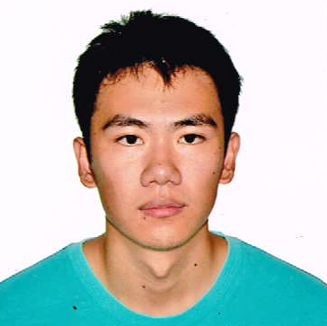

<!-- Example: 

> ## John Doe
>  
> [[Resume](johnDoe/JohnDoe-Resume.md)]
> [[Website]()]
> [[Github Profile]()]
> [[Progress](johnDoe/JohnDoe-Progress.md)]
> 
> * Expert areas: JavaScript, Node.js, Website Performance 
> * Projects: Node.js, TEAMMATES -->

------------------------------------------------

# PowerPointLabs

## ANG SHI YA
 
[[Resume](shiYa/ShiYa-Resume.md)]
[[Website]()]
[[Github Profile](https://github.com/AngShiYa)]
[[Progress](shiYa/ShiYa-Progress.md)]

* Expert areas: C#, UIX, Testing
* Projects: freeCodeCamp, NUnit, PowerPointLabs

## IAN TEO ZHI WEN

 
[[Resume](ianTeo/IanTeo-Resume.md)]
[[Website]()]
[[Github Profile](https://github.com/IanTeo)]
[[Progress](ianTeo/IanTeo-Progress.md)]

* Expert areas: C#, Performance, Testing
* Projects: PowerPointLabs, Electron, Duality

## JAMOS TAY

 
[[Resume](jamosTay/JamosTay-Resume.md)]
[[Website](https://github.com/jamos-tay)]
[[Github Profile](https://github.com/jamos-tay)]
[[Progress](jamosTay/JamosTay-Progress.md)]

* Expert areas: C#, Databases, Regex
* Projects: PowerPointLabs

## LOH JIA SHUN KENNETH

 
[[Resume](lohJiaShunKenneth/lohJiaShunKenneth-Resume.md)]
[[Website](https://github.com/Kenneth-LJS)]
[[Github Profile](https://github.com/Kenneth-LJS)]
[[Progress](lohJiaShunKenneth/lohJiaShunKenneth-Progress.md)]

* Expert areas: C#, Parallel, AI
* Projects: PowerPointLabs

## ONG HENG LE

 
[[Resume](ongHengLe/OngHengLe-Resume.md)]
[[Website](https://initialshl.github.io/)]
[[Github Profile](https://github.com/initialshl)]
[[Progress](ongHengLe/OngHengLe-Progress.md)]

* Expert areas: C#, Performance, Visual Studio Profiling Tools 
* Projects: [PowerPointLabs](https://github.com/PowerPointLabs/PowerPointLabs), [Visual Studio Code](https://github.com/Microsoft/vscode)

## SYED ABDULLAH B SYED SHEIKH

 
[[Resume](syedAbdullah/SyedAbdullah-Resume.md)]
[[Website](http://syedabdullah.net)]
[[Github Profile](https://github.com/Skaty)]
[[Progress](syedAbdullah/SyedAbdullah-Progress.md)]

* Expert areas: JavaScript, Data/Content Transfer & Processing
* Projects: pdf.js, PowerPointLabs

------------------------------------------------

# SE-EDU

## CHUA KA YI ONG

 
[[Resume](kaYi/KaYi-Resume.md)]
[[Website]()]
[[Github Profile](https://github.com/kychua)]
[[Progress](kaYi/KaYi-Progress.md)]

* Expert areas: Python, Testing, Data Science
* Projects: SymPy, se-edu

## GOH YI DA JEREMY

 
[[Resume](jeremyGoh/JeremyGoh-Resume.md)]
[[Website]()]
[[Github Profile](https://github.com/MightyCupcakes)]
[[Progress](jeremyGoh/JeremyGoh-Progress.md)]

* Expert areas: Java, DevOps, Gradle
* Projects: [SE-EDU](https://github.com/se-edu), [Tinker's Construct](https://github.com/SlimeKnights/TinkersConstruct)

## HUANG CHAO

 
[[Resume](huangChao/HuangChao-Resume.html)]
[[Website](https://chao1995.github.io/blog/)]
[[Github Profile](https://github.com/chao1995)]
[[Progress](huangChao/HuangChao-Progress.md)]

* Expert areas: Java, DevOps (Build, CI), Testing (Mocking)
* Projects: [zulip](https://github.com/zulip/zulip), [SE-EDU](https://github.com/se-edu)

## PIERCE ANDERSON FU

 
[[Resume](pierceAndersonFu/PierceAndersonFu-Resume.md)]
[[Website]()]
[[Github Profile](https://github.com/PierceAndy)]
[[Progress](pierceAndersonFu/PierceAndersonFu-Progress.md)]

* Expert areas: C++, GPGPU, CUDA
* Projects: [SE-EDU](https://github.com/se-edu)

## TAN WANG LENG

 
[[Resume](tanWangLeng/TanWangLeng-Resume.md)]
[[Website](https://yamgent.github.io/)]
[[Github Profile](https://github.com/yamgent)]
[[Progress](tanWangLeng/TanWangLeng-Progress.md)]

* Expert areas: Testing (JUnit), Java, Security
* Projects: GitHub's Electron, Addressbook

------------------------------------------------

# TEAMMATES

## CH'NG MING SHIN

 
[[Resume](ch'ngMingShin/Ch'ngMingShin-Resume.md)]
[[Website](https://github.com/ablyx)]
[[Github Profile](https://github.com/ablyx)]
[[Progress](ch'ngMingShin/Ch'ngMingShin-Progress.md)]

* Expert areas: Swift, Performance, Multi-threading
* Projects: TEAMMATES, WordPress-iOS

## LEE YI MIN

 
[[Resume](leeYiMin/leeYiMin-Resume.md)]
[[Website](https://github.com/leeyimin)]
[[Github Profile](https://github.com/leeyimin)]
[[Progress](leeYiMin/leeYiMin-Progress.md)]

* Expert areas: Java, Dev Ops (Gradle), Optimization
* Projects: TEAMMATES

## LI KAI

 
[[Resume](liKai/LiKai-Resume.md)]
[[Website](https://li-kai.github.io)]
[[Github Profile](https://github.com/li-kai)]
[[Progress](liKai/LiKai-Progress.md)]

* Expert areas: Javascript, Dev Ops (build), GraphQL
* Projects: Webpack, TEAMMATES

## TAN BOON KEONG DICKSON

 
[[Resume](dicksonTan/DicksonTan-Resume.md)]
[[Website]()]
[[Github Profile](https://github.com/Neurrone)]
[[Progress](dicksonTan/DicksonTan-Progress.md)]

* Expert areas: python, security, functional programming
* Projects: TEAMMATES

## TAN MIN RONG SAMSON

 
[[Resume](tanMinRongSamson/TanMinRongSamson-Resume.md)]
[[Website](https://samsontmr.github.io)]
[[Github Profile](https://github.com/samsontmr)]
[[Progress](tanMinRongSamson/TanMinRongSamson-Progress.md)]

* Expert areas:  Python, Scalability Testing & DevOps, Data Science & Artificial Intelligence
* Projects: matplotlib, scikit-learn, TEAMMATES

## THENAESH S/O N ELANGO

 
[[Resume](thenaeshElango/ThenaeshElango-Resume.md)]
[[Website](https://github.com/thenaesh)]
[[Github Profile](https://github.com/thenaesh)]
[[Progress](thenaeshElango/ThenaeshElango-Progress.md)]

* Expert areas: Functional Programming, Machine Learning
* Projects: TEAMMATES

## WILSON KURNIAWAN

 
[[Resume](wilsonKurniawan/WilsonKurniawan-Resume.md)]
[[Website](https://github.com/wkurniawan07)]
[[Github Profile](https://github.com/wkurniawan07)]
[[Progress](wilsonKurniawan/WilsonKurniawan-Progress.md)]

* Expert areas: Software Maintenance, DevOps (Java and JavaScript), Node.js, Website performance
* Projects: TEAMMATES, ESLint

## XIAO PU

 
[[Resume](xiaoPu/xiaoPu-Resume.md)]
[[Website](https://github.com/xpdavid)]
[[Github Profile](https://github.com/xpdavid)]
[[Progress](xiaoPu/xiaoPu-Progress.md)]

* Expert areas: Java, Static Analysis
* Projects: Teammates, Checkstyle

## YANG BOXIN

 
[[Resume](yangBoxin/YangBoxin-Resume.md)]
[[Website](https://github.com/greed-is-good)]
[[Github Profile](https://github.com/greed-is-good)]
[[Progress](yangBoxin/YangBoxin-Progress.md)]

* Expert areas: Java, Security, Machine Learning
* Projects: [zulip](https://github.com/zulip/zulip), [TEAMMATES](https://github.com/TEAMMATES/teammates)

## YONG YOONG JIE JOHN

 
[[Resume](johnYong/JohnYong-Resume.md)]
[[Website](https://whipermr5.com)]
[[Github Profile](https://github.com/whipermr5)]
[[Progress](johnYong/JohnYong-Progress.md)]

* Expert areas: Python, DevOps, Google App Engine
* Projects: TEAMMATES

