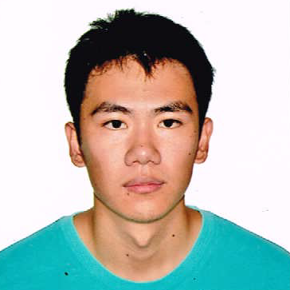

Jamos Tay
=========
 
Address: [Redacted]  
Mobile: [Redacted]  
Email: jamostay@gmail.com

Academic Experience
---------

### National University of Singapore (2015 - Present)

* Bachelor of Computing (Honours) in Computer Science
* GPA: 4.69 (Year 1)
* Enrolled in ELITe programme by IDA

### NUS High School of Mathematics and Science (2007 - 2012)

* Graduated with the NUS High School Diploma, Distinction (A-Level Equivalent)
* GPA: 4.2
* Honours in Mathematics, Majors in Computer Science, Physics, Chemistry

Work Experience
----------

### DSO National Laboratories, Intern (2011 May - 2011 Jun)

* Part of an Advanced Research Project (ARP) spanning a year
* Worked with DSO Engineer to implement a programming language sensitive to dimensional units based off C
* Presented at YDSP Congress and awarded Merit Grade

### ECS Holdings Limited, Intern (2015 May - 2015 Nov)

* Interned at IT Company that caters to IT infrastructure needs of other businesses
* Tested and modified open-source software (CURA) to work with custom 3D printers
* Designed and developed C# applications for ECS clients using Visual Studio and SQL Server
* Proposed and implemented unique solutions regarding database systems, storage and manipulation

### NUS, Research Assistant (2016 Jun - 2016 Dec)

* Collaborating with professor for a research project involving processing and analysing data of past soccer games
* Developed and optimized SQL scripts to retrieve and display relevant sets of data from a large (3GB) dataset

### NUS, Teaching Assistant (2016 Jun - Present)

* Collaborating with professor to develop an E-Learning resource for an accountancy module
* Creating an interactive website and game system to facilitate teaching of the module

Organizational Experience
--------

### Boarding School Student Leader (2011 Jan - 2011 Nov)

* Managed a hostel cluster of over 20 people
* Responsible for student welfare, such as safety issues, resident feedback and disseminating important information
* Organized and planned monthly events, and handled logistics such as expenses and equipment

Skills
--------
 
### Programming

* Fluent in Java, JavaScript, C#, VB .NET, SQL, experience in C, Python
* Basic experience in web dev: HTML/CSS, jQuery, node.js, mongoDB
* Experience with Visual Studio, Eclipse, Netbeans, SQL Server, Git

### Projects

* Participated in hackathons, such as Hack&Roll 2016 and Facebook Singapore Regional Hackathon
* Finished several online courses on Coursera and Codecademy
* Completed NUS Orbital course under Apollo 11 (most advanced) level: Developed an online multiplayer game in HTML/JavaScript and a website hosted on node.js
* Developed an online server for an online MMORPG with a small team of coders over the course of a year. Modified an open source Java server program to add custom features and new gameplay mechanics
* Created a PC port of a popular arcade game in VB .NET. Released online publicly, which garnered over 1000 downloads
