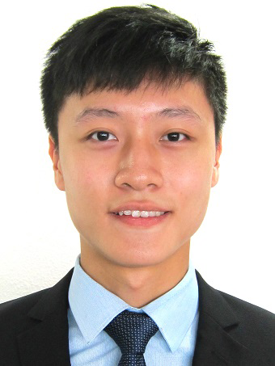

# Ong Heng Le

  
Email: [onghl@u.nus.edu](onghl@u.nus.edu)

 

## Education

August 2015 - Present:  
**National University of Singapore**  
**Bachelor of Computing (Honours) in Computer Science**  
Concurrent Degree Programme in Grad Scientiae Magistri (Computer Science) in Brown University  
Deans' List (AY2016/2017 Semester 1)

April 2010 - April 2013:  
**Temasek Polytechnic**  
**Diploma in Game & Entertainment Technology (with Merit)**  
Director's List (AY2011/2012 and AY2010/2011)

 

## Work Experiences

June 2012 - August 2012:  
**Singapore - MIT GAMBIT Summer Programme**  
**The Last Symphony**  
[http://gambit.mit.edu/loadgame/thelastsymphony.php](http://gambit.mit.edu/loadgame/thelastsymphony.php)  
Interned as a programmer at the MIT Game Lab in Massachusetts Institute of Technology (MIT)  
Worked closely with undergraduates across multiple disciplines  

Tools gained:  
* Perforce (Revision Control System) 
* Scrum methodology

 

## Technical Skills

Familiar with C#, C++ and Java  
Worked with JavaScript and ActionScript  
Software: Visual Studio 2015, Eclipse, Git, Perforce  

 

## Additional Information

Language proficiency: Bilingual, fluent in both English and Chinese (Mandarin)

 