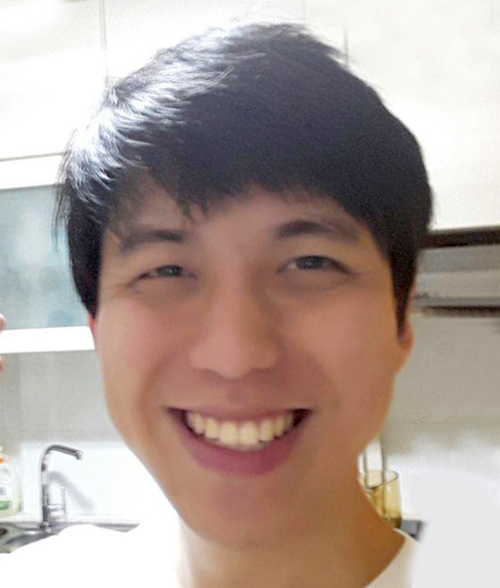

# Pierce Anderson Fu

  
Email: [pierceanderson.fu@gmail.com](pierceanderson.fu@gmail.com) 

## Profile
* Software engineer who believes in the importance of simplifying complexity and good documentation 
* Has interests in linguistics, machine translations, natural language processing 
* Silver Medallist in the 13th National Olympiad in Informatics, Singapore 

## Education

#### Bachelor of Computing (Computer Science)
##### National University of Singapore (Singapore)
###### _Expected date of graduation: December 2017_
* Focus Area: _Information Retrieval_
* Minor: _Japanese Studies (Linguistics)_

#### Summer Language Immersion Programme 
##### Tamagawa University (Machida, Tokyo)
* Month-long immersion programme 

#### GCE 'A' Level
##### Dunman High School (Singapore)
* H2: _Computing. Mathematics, Physics_
* H1: _General Paper, Economics_

## Skills

#### Programming Languages
* Proficient: _Python 2.7/3.5, Java, JavaScript, C++_
* Familiar: _PHP, MySQL, HTML5, CSS3, R_

#### Libraries and Frameworks
* Proficient: _NLTK, Stanford CoreNLP, jQuery, JUnit_
* Familiar: _Tensorflow, Bootstrap_

#### Operating Systems
* Proficient: _Windows_
* Familiar: _Unix_

#### Software
* Proficient: _Git, PyCharm, Eclipse, PhpStorm_
* Familiar: _Vagrant, AutoHotKey_

#### Natural Languages
* Native: _English, Mandarin_
* Business Proficiency: _Japanese (JLPT N2)_

## Work Experience

#### Teaching Assistant for CS2103 Software Engineering (Java)
##### National University of Singapore
###### _August 2016 - December 2016_
* Provided weekly instruction and guidance through tutoring and mentoring to a group of 8 students
* Led discussions on modern software engineering concepts and their applications
* Evaluated programming homework and projects and provided timely feedback 

#### Teaching Assistant for Programming Refresher Workshop (Java, C++) 
##### National University of Singapore
###### _July 2016_
* Taught a class of more than 30 freshman undergraduates at a programming and problem-solving skills workshop
* Guided students’ thought processes though Socratic questioning 
* Covered topics such as recursion, sorting, searching, divide-and-conquer 

#### Undergraduate Research Assistant (Python, Java, Scala)
##### National University of Singapore
###### _May 2016 - July 2016_
* Scraped HTML files and applied topic modelling techniques
* Analysed sentiments of online news articles and major internet-based retailer’s product reviews through NLP
* Provided active support to lead researcher in the study of interplays between social media and business models 

## Projects

#### Viterbi Part-of-Speech Tagger (https://git.io/vP2gA) 
##### Software Engineer (Python)
###### _October 2016_
* Tags each word in input sentences with its part-of-speech (POS) tags with 95.5% accuracy  
* Trains a hidden Markov model using a tagged training corpus
* Decodes the best POS tag sequence for a sentence using the Viterbi algorithm 

#### Movie Genre Classifier (https://git.io/vwC5m) 
##### Software Engineer (Python)
###### _April 2016_
* Builds a word bigram language model using IMDb's database, and classifies movies' genres 
* Given a movie’s synopsis, returns its list of most probable genres, in order of likelihood

#### SoCPlans.com (http://SoCPlans.com) 
##### Software Engineer, Back-end (PHP, Python, MySQL) 
###### _April 2016_
* Created a web application to help NUS undergraduates verify their eligibility for graduation and simplify module planning
* Worked in a small team of 6 as the back-end programmer

#### Ranked Document Retrieval (https://git.io/vVHMG) 
##### Software Engineer (Python)
###### _March 2016_
* Indexes a corpus, and provides ranked document retrieval using a vector space model
* Worked closely with partner, and learnt to communicate effectively while working on adjacent components
* Pair programmed core components 

#### Haystack (https://git.io/vwRBH) 
##### Team Leader, Software Engineer (Java, Junit, Git)
###### _August 2014 - December 2014_
* Created command-line interface based task management tool using MVC framework 
* Managed team and delegated tasks to members based on strengths, abilities, and potential  
* Developed software with modern software practices such as unit development, automated unit testing, agile software development
