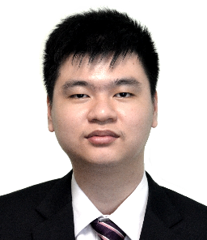

# Tan Wang Leng

 
Email: [tanwangleng@outlook.com](tanwangleng@outlook.com) 
GitHub: [https://github.com/yamgent](https://github.com/yamgent) 
LinkedIn: [https://www.linkedin.com/in/wang-leng-tan-bab969b1](https://www.linkedin.com/in/wang-leng-tan-bab969b1)

## Education

August 2015 - Present: **National University of Singapore** (Singapore) 
**BComp, Computer Science** (Focus Area: Computer Security) 

* CAP: 4.96/5.00
* Academic Accomplishments:
    * IMDA Integrated Infocomm Scholar (2010)
    * Dean's List for AY16/17 Sem 1

---

April 2010 - April 2013: **Temasek Polytechnic** (Singapore) 
**Diploma (with Merit), Game and Entertainment Technology** and **Certificate in Business Fundementals** 

* GPA: 3.94/4.00
* Academic Accomplishments:
    * Diploma's Gold Medallist (together with Lee Kuan Yew Award and 4 other awards)
    * IMDA Integrated Infocomm Scholar (2010)
    * Director's List for AY10/11, AY11/12, AY12/13
* Co-curricular Highlights:
    * World Skills Leipzig 2013 (International Finals, Category: IT Software Solutions for Business)
        * Sliver Medallist
    * Microsoft Office Student Interest Group (MoSIG)
        * Co-founder, Vice-President of MoSIG (2012-2013)
        * Developed training materials and conducted training sessions for Microsoft Office 2010

## Work Experiences

August 2013 - September 2013: **DSO National Laboratories** 
Intern

---

May 2013 - June 2013: **Borneo Motors** 
Information Systems Intern

*Responsibilities:* 

* Providing advice regarding integration of Microsoft Office into business processes.
* Studying usage issues pertaining to Microsoft Excel in the financial department, and proposing solutions to improve the workflow.

## Project Experiences

### Contributions to OSS Projects

* [se-edu](https://se-edu.github.io/) ([Committer](https://se-edu.github.io/docs/Team.html))
    * Progress Report: [Link](https://github.com/nus-oss/cs3281-website/blob/master/students/AY1617S2/tanWangLeng/TanWangLeng-Progress.md)
    * Worked on improving the Java desktop projects used by CS2103T Software Engineering teaching team, that will be used by NUS undergraduate students as the foundation of their graded project.
    * [se-edu's learningresources](https://github.com/se-edu/learningresources/): Contributed to book chapter:
        * [Cross Site Scripting](https://github.com/se-edu/learningresources/pull/4)

* [GitHub's Electron](https://github.com/electron/electron) ([Contributor](https://github.com/electron/electron/pulls?utf8=%E2%9C%93&q=is%3Apr%20author%3Ayamgent))
    * PRs contributed:
        * [Fix webpreferences not accepting numeric options #8542](https://github.com/electron/electron/pull/8542)
        * [Support message, nameFieldLabel and showsTagField for macOS dialog #8556](https://github.com/electron/electron/pull/8556)

### Other Projects

* CP3108B: Independent Work [Orbital]
    * Archive Repository: [Link](https://github.com/yamgent/orbital-2016)
    * Used the Ruby on Rails framework
    * Wrote a prototype website to explore possible improvements that could be made for the interface of the NUS course bidding website used by undergraduates.

* Major Project (Temasek Polytechnic)
    * As a lead programmer, developed a top-down 3D game in Unity3D engine titled "Morality" with a team of 5 other fellow student developers.
    * Targeted towards youths aged 10 - 16, with the aim of teaching them good moral values and habits.

## Technical Skills

Familiar OS: Windows, Ubuntu Linux

Proficient Languages:
* Java
    * Main programming language used for CS2103T "Software Engineering" project in NUS.
        * Archive Repository of graded project: [Link](https://github.com/CS2103AUG2016-W11-C4/main).
* C#
    * Used as a scripting language in Unity3D to develop our Major Project, "Morality", in Temasek Polytechnic.
* C++
    * Contributed to [github's Electron](https://github.com/electron/electron/pulls?utf8=%E2%9C%93&q=is%3Apr%20is%3Aclosed%20author%3Ayamgent) project, which uses C++.
    * Main programming language used for OOGP "Object Oriented Game Programming", an 8CU module in Temasek Polytechnic.

Familiar with DevOps tools:
* Travis, Gradle, Codacy, Coveralls
    * Used in CS2103T "Software Engineering" project in NUS. [Link](https://github.com/CS2103AUG2016-W11-C4/main).

Familiar with IDEs: Visual Studio, Eclipse 
Familiar game frameworks: Unity3D, Simple DirectMedia Layer

## Others

* Able to converse in English, Mandarin Chinese
* Gave a talk to [NUS Hackers](http://nushackers.org/) on Feburary 3, 2017.
  * Topic: Cross Site Scripting
* Participated in hackathon on December 2, 2016: NUS GDG Gamecraft! 2016
