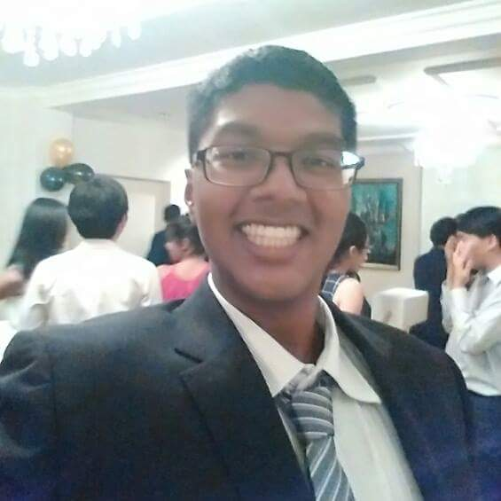

# Thenaesh Elango

  
Email: [thenaeshelango@gmail.com](thenaeshelango@gmail.com) 

## Education

#### [In Progress] Bachelor of Computing (Computer Science), _National University of Singapore_

* Turing Programme
* Focus Areas: _Algorithms & Theory, Artificial Intelligence, Information Security_

#### [In Progress] Bachelor of Science, _National University of Singapore_

* Major: Mathematics

#### GCE 'A' Level, 4 Distinctions, _Raffles Institution_

* H2: _Physics, Chemistry, Mathematics, Economics_
* H3: _Essentials of Modern Physics_

#### GCE 'O' Level, L1R5: 2, _Victoria School_

## Skills

#### Programming Languages

  * Proficient: _C, C++03, Java, JavaScript, Bash_
  * Familiar: _Haskell, Scheme, Python, Ruby, JavaScript ES2015, C++11/14_

#### Web Development

  * Markup: _HTML, CSS, Jade/Pug_
  * Libraries: _jQuery, Bootstrap_
  * Frameworks: _Node.js, Flask, Rails, Electron_

#### Databases

  * Languages: _SQL_
  * RDBMS: _SQLite_

## Work Experience

#### Teaching Assistant for CS1101S Programming Methodology, __National University of Singapore__

* _August 2015 - December 2015_
* _August 2016 - December 2016_
* Led a discussion group of 8 students, teaching them programming initially from a functional perspective and later from an imperative perspective.
* Graded programming assignments and midterm examinations.
* Created and maintained teaching materials for the course.
* Handled administrative work for various aspects of the course.

#### Teaching Assistant for CS1231 Discrete Structures, _National University of Singapore_

* _August 2015 - December 2015_
* Taught a tutorial of 20+ students, teaching them mathematics fundamentals, including set theory, functions, relations, mathematical induction, basic number theory, combinatorics and graph theory.
* Graded written assignments.

## Community Service

#### Software Engineer & System Administrator, _National University of Singapore Students' Computing Club_

* _August 2016 - September 2017_ (19th IT Subcommittee)
* Simplified the creation of the Club's weekly email blasts:
  * Created an Electron app that allows entry of email blast parameters (title, image, text) in a simple, intuitive format.
  * Great advancement over the old command-line interface that was difficult to use for anyone untrained in command-line usage.

#### Vice-President (Human Resource and Development), _National University of Singapore Students' Computing Club_

* _August 2015 - September 2016_ (18th Management Committee)
* Oversaw a portfolio of 3 cells (academic liaison, student welfare, sports), helping to maximise the impact of their activities while also staying within NUS regulations
* Facilitated the expansion of student welfare with significantly more welfare packs and additional events such as during Halloween
* Facilitated and supervised the NUS Data Science Student Challenge organised by the Academic Liaison Cell together with Microsoft, the first ever hackathon organised by the Club

#### Director of Academic Liaison, _National University of Singapore Students' Computing Club_

* _August 2014 - September 2015_ (17th Management Committee)
* Spearheaded several workshops to help students acquire practical computing skills
  * Java Confidence Course
  * Unix Workshop
  * Introduction to Hybrid Mobile Apps (sponsored by JetBrains)
* Organised a day-long sharing session for incoming freshmen with the objective of giving them a clear picture of academic life and career prospects after graduation
* Organised mock practical examinations for freshmen to become acquainted with the actual environment of the practical examinations in the School of Computing

## Talks

**_July 2015_ Gave a short introduction to Haskell in a seminar series conducted in the NUS School of Computing**

**_January 2015, January 2016_ Lectured at a workshop on the Java language**

* Aimed at giving students a headstart in modules/courses requiring knowledge of the language
* Covered object-oriented programming concepts
* Introduced static typing to students who were mostly familiar with dynamically-typed languages

**_January 2015, August 2015_ Lectured at a workshop on Unix**

* Aimed at introducing students to software development and deployment on Unix-like operating systems like Linux
* Covered Unix filesystem concepts and bash scripting, going into significant detail regarding pipes and I/O redirection
* Introduced students to the Unix philosophy of writing small, specialised programs
